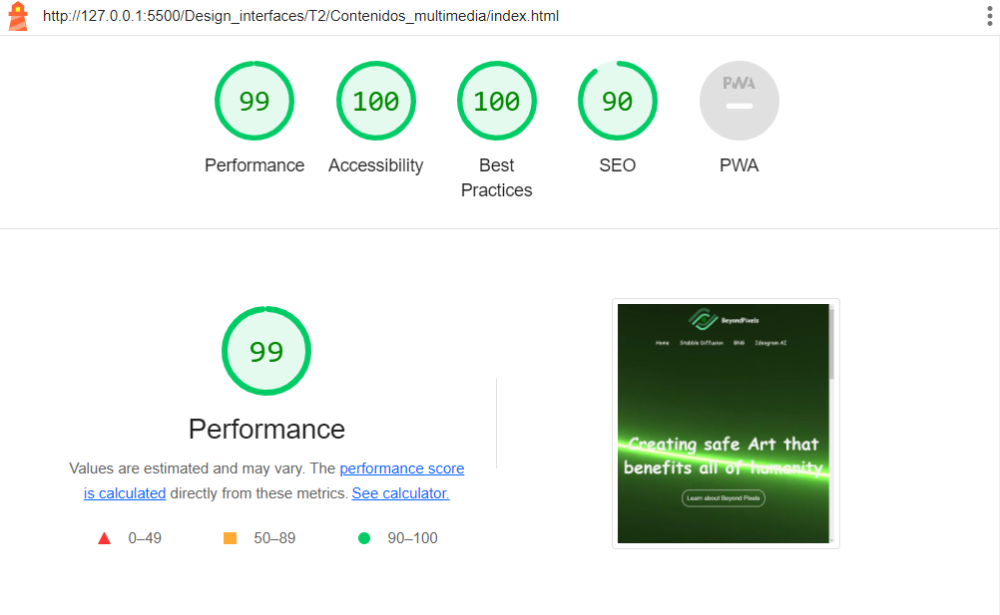

- [BeyondPixels](#beyondpixels)
  - [Idea](#idea)
  - [Logos](#logos)
  - [Promt for AI](#promt-for-ai)
  - [Evalucación de rendimiento](#evaluación-de-rendimiento)

## BeyondPixels
### Idea
<p>La de Idea de Beyond Pixels es una comunidad que recoge toda la informacion posibles de todas las nuevas IAs del momento, tanto para hacer imagenes, herramientas de ayuda, se dispone a ser una web para discutir sobre estos temas</p>

### Logos
<p>
El logo ha sido diesñado con Inkspace, segui la idea de BoyendPixels por eso se representa con el simbolismo de un ojo moderno  que puede capturar los que pasa el vida cotidiana.
</p>

### PROMT FOR AI
```
Genera un logo moderno que represente contenidos multimedia. Utiliza la siguiente paleta de colores:

--primary-color: #13a851
--secondary-color-light: #5ac98b
--secondary-color-dark: #0f803f
--accent-color: #ff8c00
--background-color: #f7f7f7
--text-color: #333333
--button-color: #13a851
--hover-color: #1dbb6b

El logo debe tener un diseño elegante y contemporáneo, con formas que evocan una galería de imágenes o cualquier otro elemento relacionado con contenidos multimedia. Puedes experimentar con la disposición de píxeles o cualquier otro efecto visual que sugiera modernidad.

Ten en cuenta que el logo será utilizado para representar una plataforma de contenidos multimedia en línea. ¡Sé creativo!

```
### Evaluación de rendimiento
#### Sin optimizar
General

Procesamiento de imagenes

#### Optimizadas (Lazy load, set witdh...)
General

Procesamiento de imagenes


#### Comparación de imagenes

Como podemos ver las iamgenes que mas se adaptan a la web son el formato de .webp