# FILE SERVER

**1. Crear la estructura de UO en tu servidor:**
   -

**2, 3, 4. Crear los grupos,  Añadir usuarios a los grupos:**
   - Desde la misma herramienta "Active Directory Users and Computers," crear los grupos **GContabilidad**, GRRHH, GSistemas, GDesarrollo.
   - Agrega usuarios a los grupos correspondientes utilizando la herramienta "Active Directory Users and Computers."
   -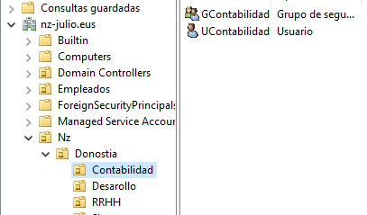
   -
   -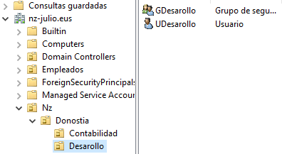
   -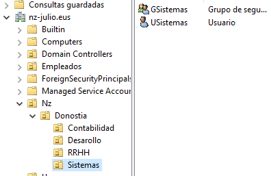

**5. Deshabilitar herencia de permisos:**
   - En la confuguracion de recusos compartidos, especificando los permisos para el control de acceso, en persimos personalizados, deshabilitar la herencia.
   -

**6. Habilitar enumeración basada en accesos:**
   - En los parametros de la configuracion de recursos compartidos habilitar las casilla 
   -

**7. Mapear unidades de red:**
   - Desde las propeidades del Miembro del Perfil selecionamos la opción de conectar y la configuramos con la ruta y aplicamos los cambios,
   -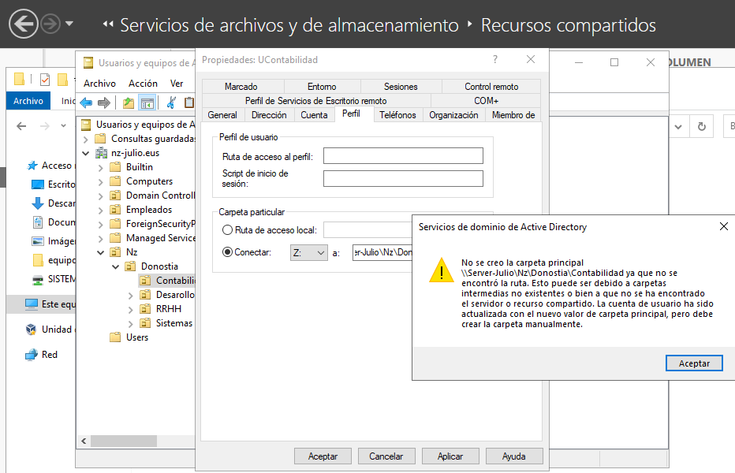

**8. Mapear unidades de red desde el Active Directory:**
   -Desde el Usuario en el explorador de archivos, nos conectamos a una unidad de red desde "Este equipo" y configuramos con el la ruta del recurso compartido compartido:
   -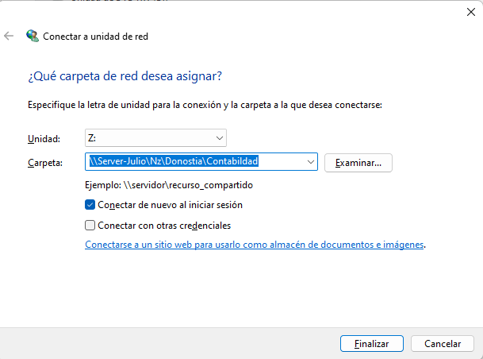 

**9. Mapear unidades de red usando GPOs:**
   - En la herramientas de Servidor con la Adminictrasión de directaivas de Grupo Asignamos un controlador que creamos con la confugarición que aparece en pantalla. Para obtener los cambios Actualizaremos desde la terminal del servidor con el siguiente comando gpupdate /force
   -
   -
   -
<bold>Aclaración: Los ejemplos del 7-9 solo se muestra con el caso de Contabilidad, el recurso compartido es /Nz/Donostia/...**</bold>

**10. Habilitar la auditoría a nivel del controlador de dominio:**
- Panel de servidor > Heramientas > Directivas a nivel de grupo. Ir dondé se encuntra Directiva de Auditoría en Pantalla y configurar la primera directiva como aparece en pantalla. y Desde la terminal del servidor actulizar las directivas.
   -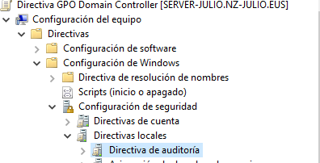
   -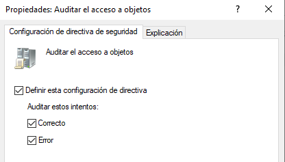

**11,12. Habilitar la auditoría para un usuario específico en una carpeta, Probar eliminar archivos y crear carpetas:**
   -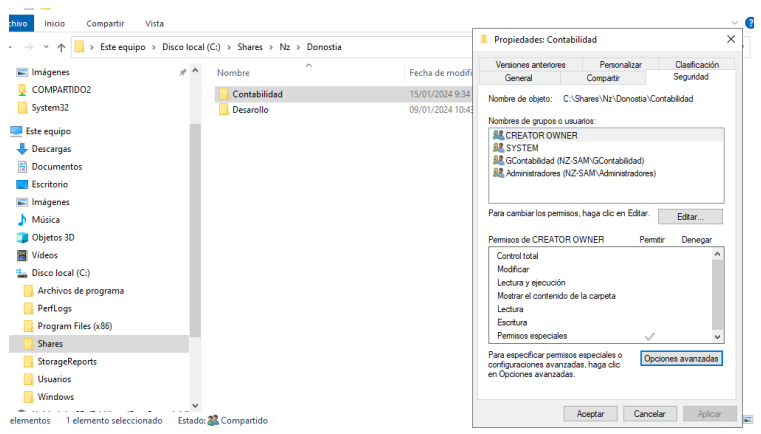
   -
   -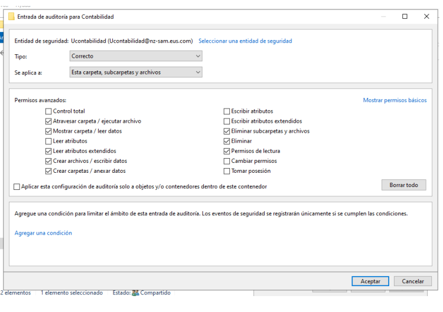
   -Hay que crear una auditoria para Nz támbien, en Domain controllers
   -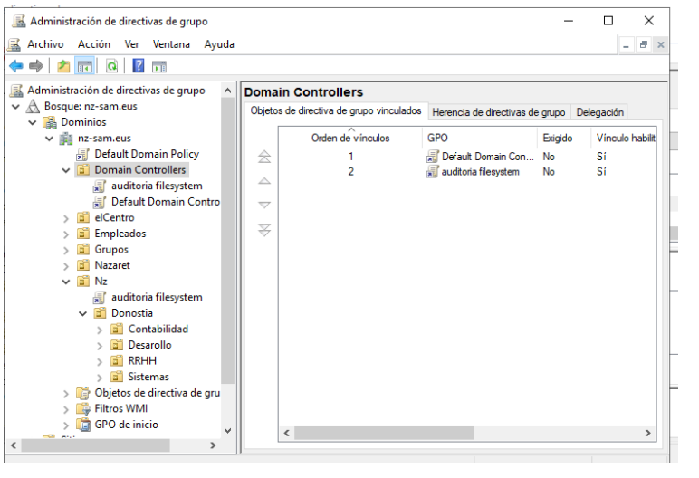
   -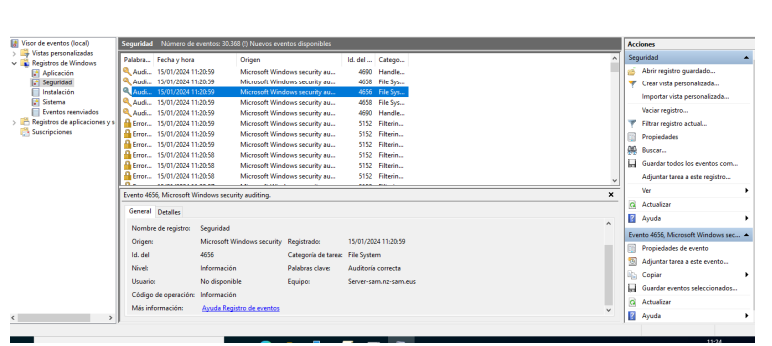
   -Aquí popdemos ver que el usuario UContabilidad solo puede acceder a la carpeta Contabilidad
   -

