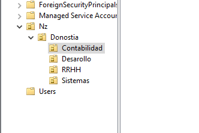

# FILE SERVER

**1. Crear la estructura de UO en tu servidor:**

**2, 3, 4. Crear los grupos,  Añadir usuarios a los grupos:**
   - Desde la misma herramienta "Active Directory Users and Computers," crear los grupos GContabilidad, GRRHH, GSistemas, GDesarrollo.
   - Agrega usuarios a los grupos correspondientes utilizando la herramienta "Active Directory Users and Computers."
    
    
    
    

**5. Deshabilitar herencia de permisos:**
   - En la confuguracion de recusos compartidos, especificando los permisos para el control de acceso, en persimos personalizados, deshabilitar la herencia.
   - 

**6. Habilitar enumeración basada en accesos:**
   - En los parametros de la configuracion de recursos compartidos habilitar las casilla 
   - 

**7. Mapear unidades de red:**
   - Desde el Explorador de Windows en el equipo cliente, selecciona "Conectar a unidad de red" y asigna la letra de unidad y la ruta UNC correspondiente.

**8. Mapear unidades de red desde el Active Directory:**
   - Puedes usar scripts de inicio de sesión o políticas de grupo para asignar unidades de red a los usuarios. Configúralo en las propiedades del usuario en "Active Directory Users and Computers."

**9. Mapear unidades de red usando GPOs:**
   - Crea una nueva GPO en "Group Policy Management Console."
   - Configura la asignación de unidades en "Configuración de usuario → Preferencias → Configuración de Windows → Asignación de unidades."

**10. Habilitar la auditoría a nivel del controlador de dominio:**
    - Abre "Group Policy Management Console" y crea una nueva GPO para la auditoría.
    - Configura la auditoría en "Configuración del equipo → Configuración de seguridad → Directivas locales → Auditoría de seguridad."

**11. Habilitar la auditoría para un usuario específico en una carpeta:**
    - En las propiedades de la carpeta NZ, ve a "Seguridad → Opciones avanzadas → Auditoría."
    - Agrega al usuario de contabilidad y configura los eventos de auditoría según sea necesario.

**12. Probar eliminar archivos y crear carpetas:**
    - Accede desde el equipo cliente con el usuario de contabilidad y realiza las acciones permitidas.
    - Verifica el Visor de eventos para confirmar que se ha auditado correctamente.

Recuerda adaptar estos pasos según la configuración específica de tu entorno y las herramientas que estés utilizando. Además, ten precaución al realizar cambios en la configuración de permisos y auditoría para evitar problemas no deseados.