**Práctica 1: Configuración Básica del Sitio Web en IIS**

1. **Creación de la estructura de carpetas y archivos:**
   - Instalción de servidor IIS(Adminstrar->Agregar Roles y caracteristicas):
   - 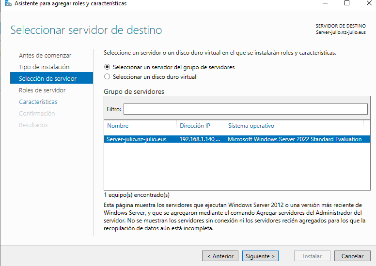
   - 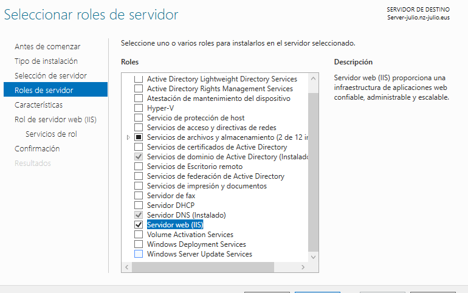
   - 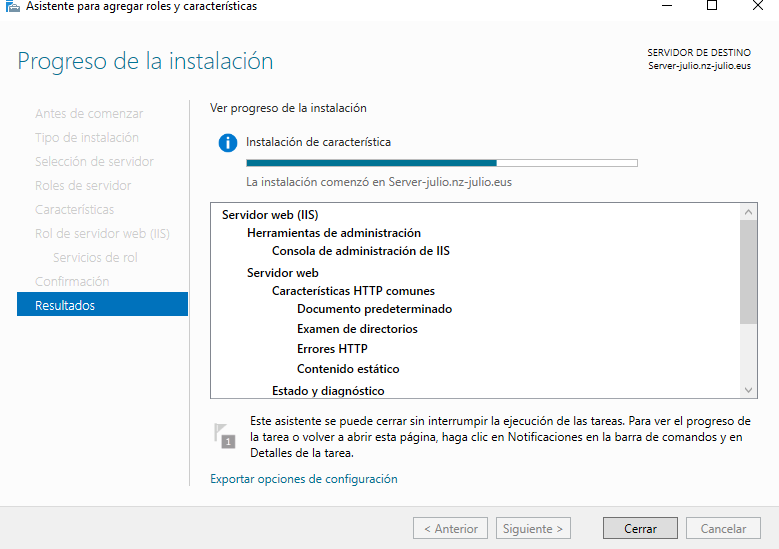
   - Crea una página sencilla llamada `index.html`.
   - Crea una carpeta llamada `Miweb` dentro de `C:\inetpub\wwwroot`.
    - 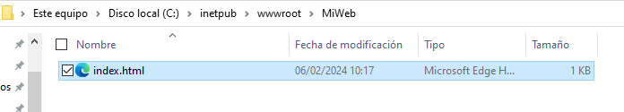

2. **Añadir el sitio web en IIS:**

   - Abre la consola de Administrador de Internet Information Services (IIS).
   - 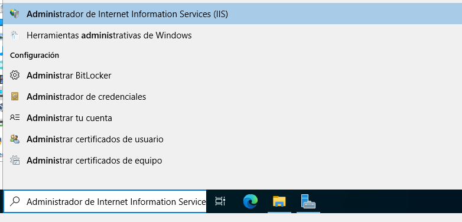
   - En el árbol de la izquierda, haz clic derecho en `Sitios` y selecciona `Agregar sitio web`.
   - 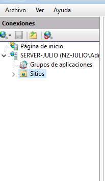
   - Completa los campos requeridos, como el nombre del sitio web y la ruta física (en este caso, `C:\inetpub\wwwroot\Miweb`).
   - Asigna un puerto (generalmente el 80 para HTTP) y, opcionalmente, una dirección IP.
   - Haz clic en `Aceptar` para crear el sitio web.
   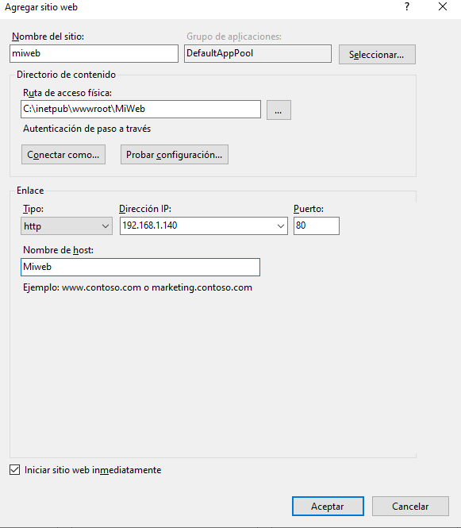

3. **Configuración del documento predeterminado:**
   - En la consola de IIS, selecciona tu sitio web.
   - En la sección de `Documentos predeterminados`, añade `index.html` como documento predeterminado si no está presente.
   - 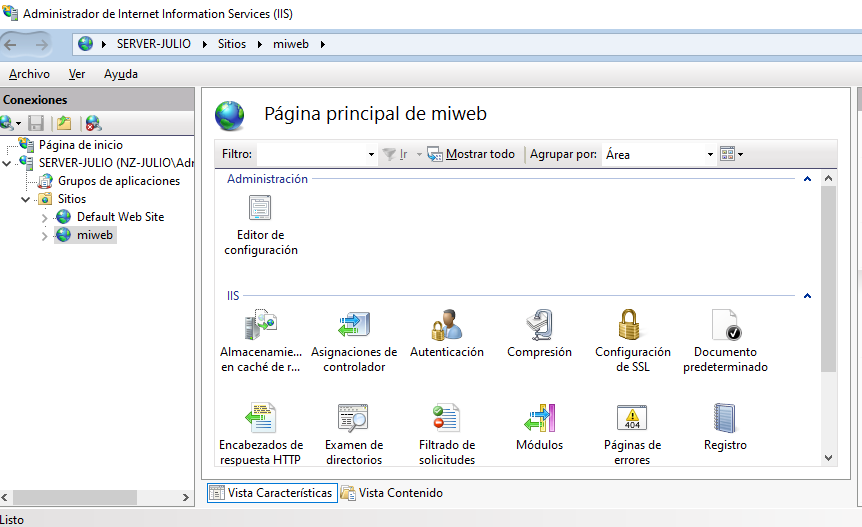
   - 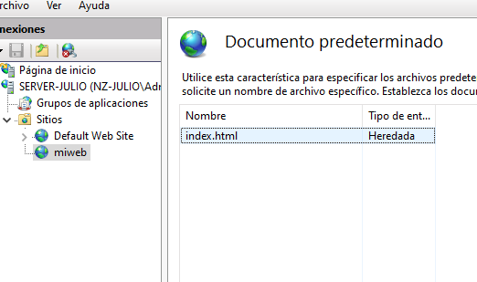

4. **Creación de un nombre DNS para el sitio web:**
   - Abre la consola de administración de DNS en el servidor.
   - 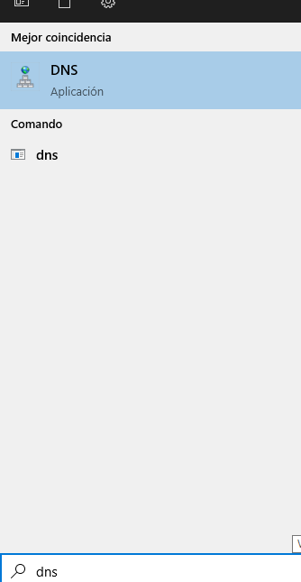
   - Agrega una entrada de tipo `A` o `CNAME` para asignar un nombre DNS a la dirección IP del servidor donde está alojado el sitio web.
   - 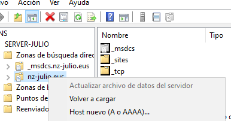
   - 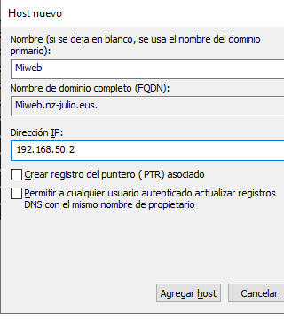

5. **Actualizar el servidor web y el sitio:**
   - Guarda todos los cambios realizados.
   - 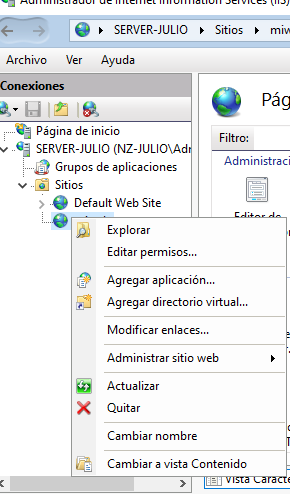

**Práctica 5: Habilitar Autenticación Básica en IIS**

1. **Agregar el rol de Autenticación Básica:**
   - Abre la consola de Administrador de Internet Information Services (IIS).
   - Navega hasta `Servidor web IIS -> Seguridad -> Autenticación básica`.
   - Habilita la autenticación básica.
   - 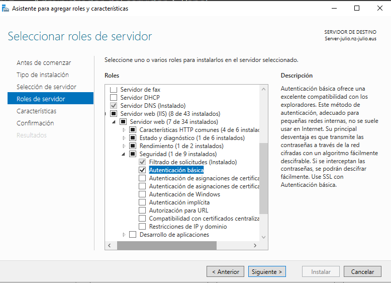

2. **Reiniciar el servidor web:**
   - Desde el símbolo del sistema, ejecuta el comando `iisreset` para reiniciar el servidor web y aplicar los cambios.
   - 
   - 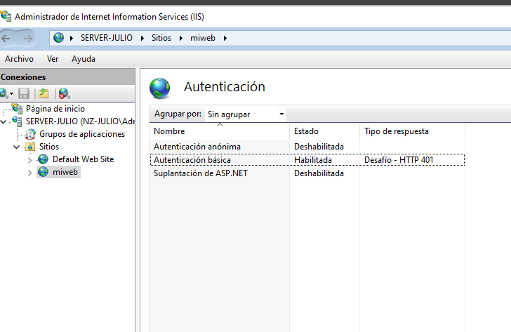

3. **Configurar la autenticación para el sitio web:**
   - En la consola de IIS, selecciona tu sitio web.
   - En la sección de `Autenticación`, deshabilita la autenticación anónima y habilita la autenticación básica.
   - 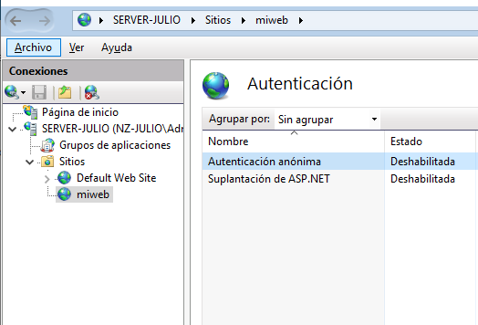

4. **Reiniciar el servicio de IIS si es necesario:**
   - Detén y vuelve a iniciar el servicio de IIS desde la consola de servicios si los cambios no se aplican correctamente.
   - 

5. **Comprobar la autenticación:**
   - Accede al sitio web desde un navegador.
   - Debería solicitarte un usuario y una contraseña para la autenticación básica.