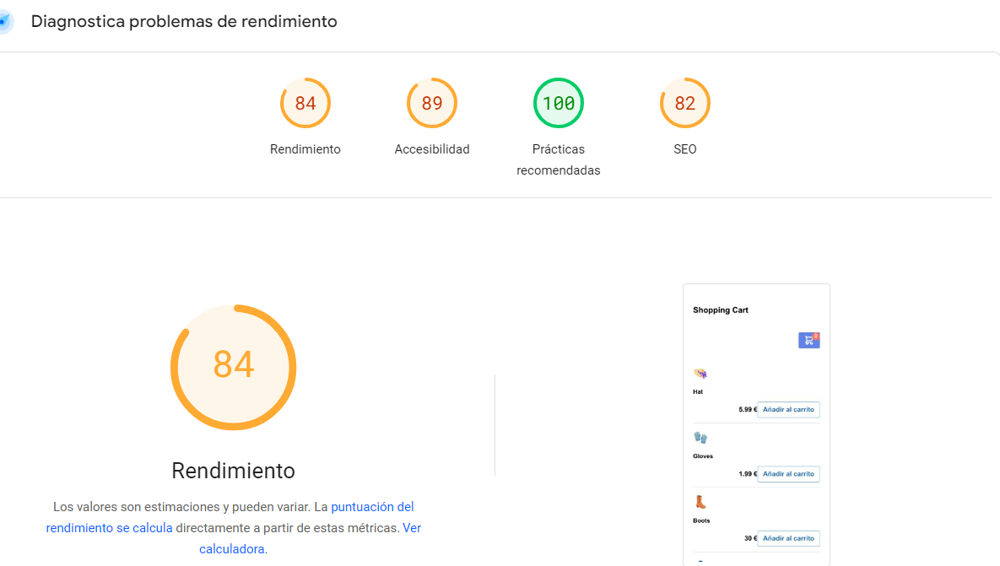
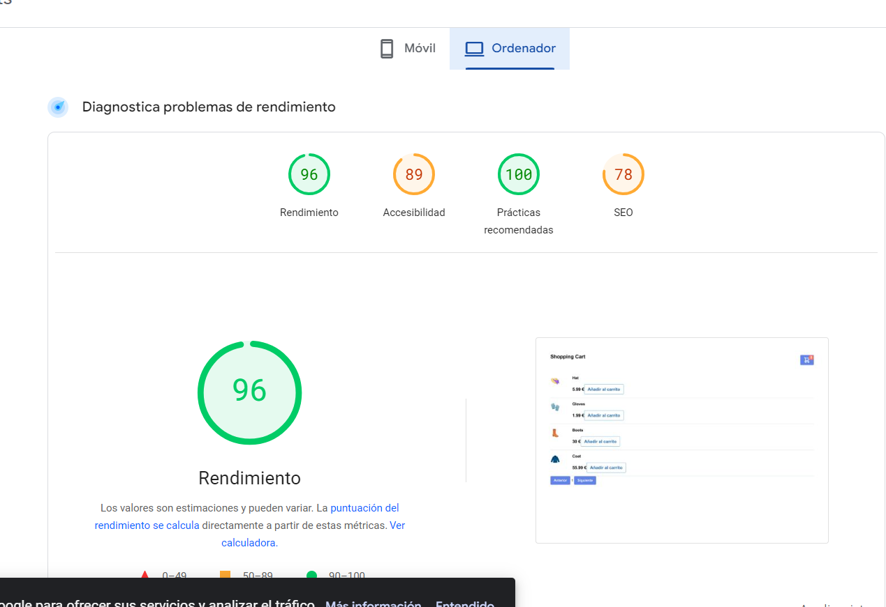

# Carrito De La Compra (Vue, TailwindCSS)

## Vue
<p>Uso vue como los Componentes</p>

```
Vue.component('product', {
    props: ['articulo'],
    template: `
        <div class="flex flex-col md:flex-row border-b border-gray-400 py-4">
            <div class="flex-shrink-0 w-20 h-auto text-4xl">
                {{articulo.img}}
            </div>
            <div class="mt-4 md:mt-0 md:ml-6 text-xl">
                <h2 class="text-lg font-bold">{{articulo.title}}</h2>
                <p class="mt-2 text-gray-600">{{articulo.description}}</p>
                <div class="mt-4 flex items-center">
                    <span class="ml-auto font-bold">{{articulo.price}} €</span>
                    <button @click="agregarArticuloAlCarrito(articulo.id, articulo.title, articulo.img, articulo.price)" class="hover:bg-blue-500 text-blue-700 font-semibold hover:text-white py-2 px-4 border border-blue-500 hover:border-transparent rounded">
                        Añadir al carrito
                    </button>
                </div>
            </div>
        </div>
    `,
    methods: {
        agregarArticuloAlCarrito(id, title, img, price) {
            this.$emit('agregar_articulo_al_carrito', { id, title, img, price });
        }
    }
});
```


## TailwindCSS
<p>Tailwindcss framework css, para maquetar más rapido y eficientemente código CSS.</p>

## Speed Wev ( Google Page Speed Insight )


|    |      MOBILE      |  DESKTOP |
|----------|:-------------:|------:|
| ENLACE|  [Análisis de la página en móvil ](https://pagespeed.web.dev/analysis/https-65a166f0ffa33013621f5aea--lustrous-begonia-f6e9dd-netlify-app/2dhe5vpn1j?form_factor=mobile) | [Análisis de la página en Oredenador ](https://pagespeed.web.dev/analysis/https-65a166f0ffa33013621f5aea--lustrous-begonia-f6e9dd-netlify-app/2dhe5vpn1j?form_factor=desktop) |
| IMAGÉN |       |    |
    